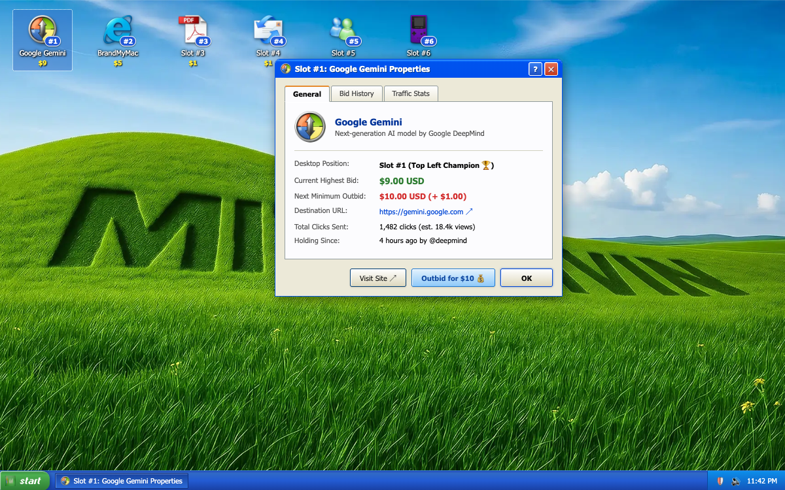
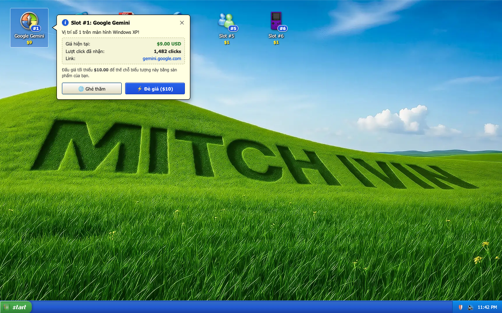

# WindowBid XP

An interactive Windows XP desktop simulator & pay-to-rank advertising platform by [Lê Anh Ngọc](https://github.com/ngocla99).

Live Demo: [xpbid.lol](https://xpbid.lol/)

  

## About WindowBid

**WindowBid** reimagines online project discovery through the nostalgic lens of early-2000s computing. Built as a fully functional recreation of the classic **Windows XP Luna** desktop shell, WindowBid functions as a competitive digital billboard and pay-to-rank auction system.

Creators, founders, and indie hackers bid for numbered desktop shortcut slots on a shared public desktop. Highest bidders claim the most visible real estate (such as Slot #1 in the top-left corner), receiving direct traffic, custom icon branding, and comprehensive engagement analytics.

  

## Core Mechanics

- **Desktop Slots (#1 to #N):** Fixed desktop positions represented as authentic OS shortcut icons displaying an Occupant's project name, custom icon, and current bid price.
- **Shortcut Launch:** Double-clicking any Slot icon launches the Occupant's destination URL directly in a new browser tab.
- **Properties Window & Tooltip:** Clicking a Slot opens a retro Windows XP Properties dialog displaying current bid valuation, destination link, click stats, and bid history.
- **Real-Time Outbid Engine:** Outbid the current Occupant with an instant transaction. When an Occupant is outbid, they are immediately replaced on the Desktop.
- **Recycle Bin (Eviction Archive):** Evicted Occupants are automatically moved to the desktop **Recycle Bin**, preserving their historical bid legacy and providing a one-click revenge bid mechanism to reclaim their spot.
- **Grace Period Protection:** New winning bids receive a temporary cooldown window where the Slot cannot be instantly snatched away.

## The Luna Shell

- **Bliss Wallpaper & 3D Topiary:** Classic rolling green hills with custom 3D sculpted landscape typography.
- **Interactive Taskbar:** Iconic green **Start** button, active running window tabs, and a recessed system tray with network/security icons and real-time clock.
- **Authentic XP Chrome:** Authentic window title bars, classic tab controls, bevelled push buttons, and retro dialog styling.

## Tech Stack

- **Framework:** Next.js (App Router), React, TypeScript
- **Styling:** Tailwind CSS, XP.css & custom Windows XP Luna theme design system
- **Backend & Database:** Supabase (Realtime events, Postgres database)
- **Payments:** Dodo Payments integration for automated slot bidding & outbidding
- **Deployment:** Vercel

## References & Credits

Built with inspiration and assets from the retro web community:

- **Windows XP High Resolution Icon Pack:** [marchmountain/-Windows-XP-High-Resolution-Icon-Pack](https://github.com/marchmountain/-Windows-XP-High-Resolution-Icon-Pack/releases/tag/02)
- **MitchIvin XP (Windows XP Web Simulator):** [mitchivin.com](https://mitchivin.com/) | [GitHub (mitchivin/MitchIvin-XP)](https://github.com/mitchivin/MitchIvin-XP)
- **XP.css:** [botoxparty/XP.css](https://botoxparty.github.io/XP.css/) by botoxparty

## Legal & Disclaimer

Windows XP imagery, icons, audio, and trademarks belong to Microsoft Corporation. WindowBid is an independent indie project, interactive showcase, and parody, not an official Microsoft product.

## License

Source code for the core application remains private.
